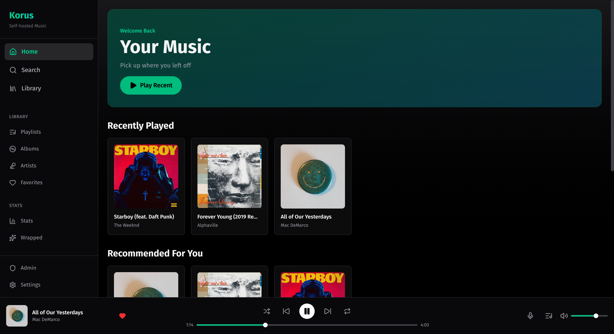
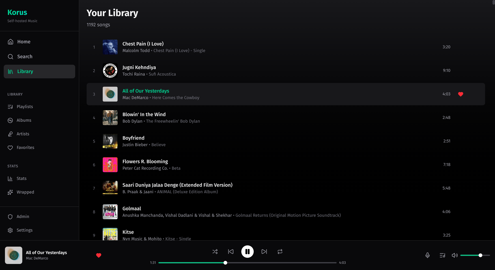
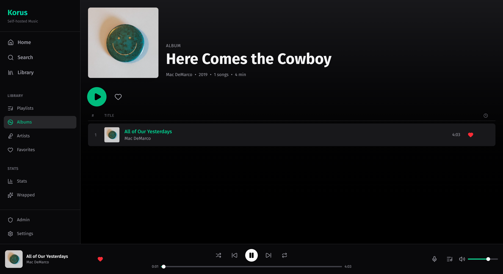
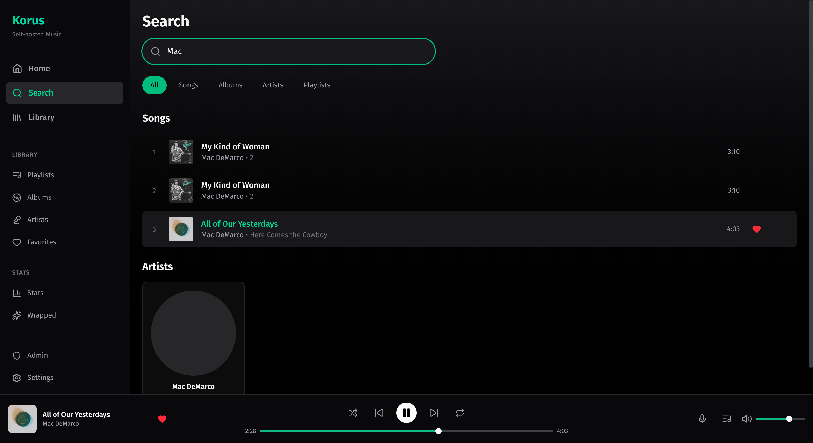
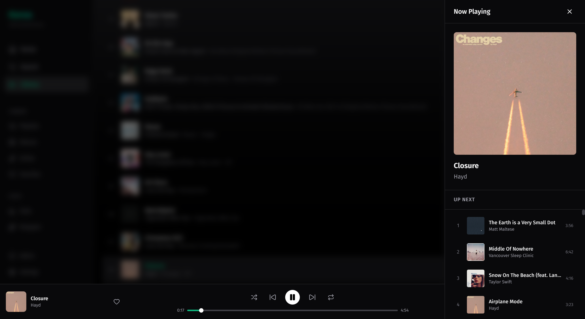
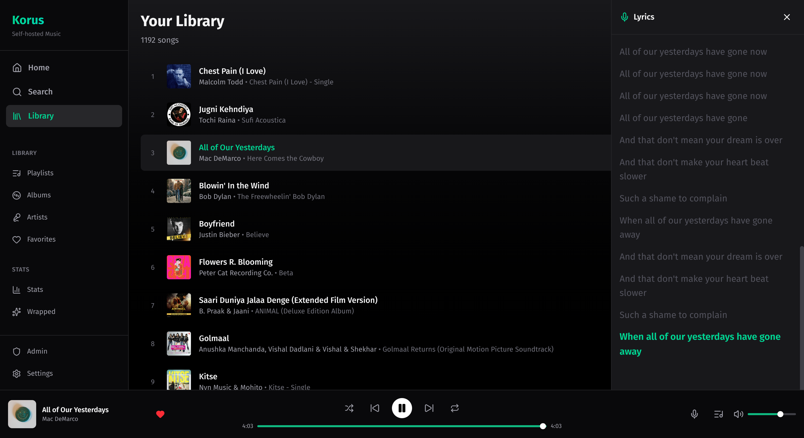
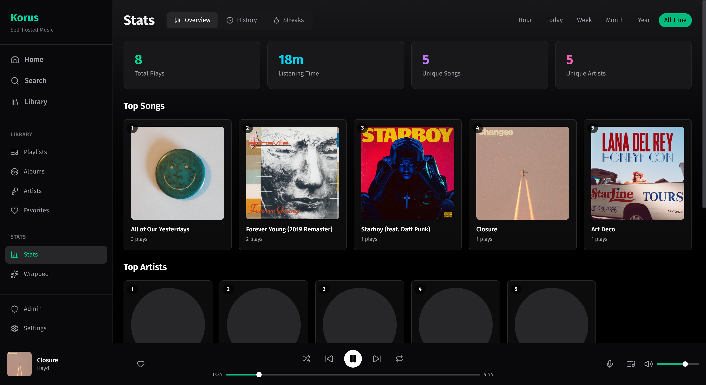
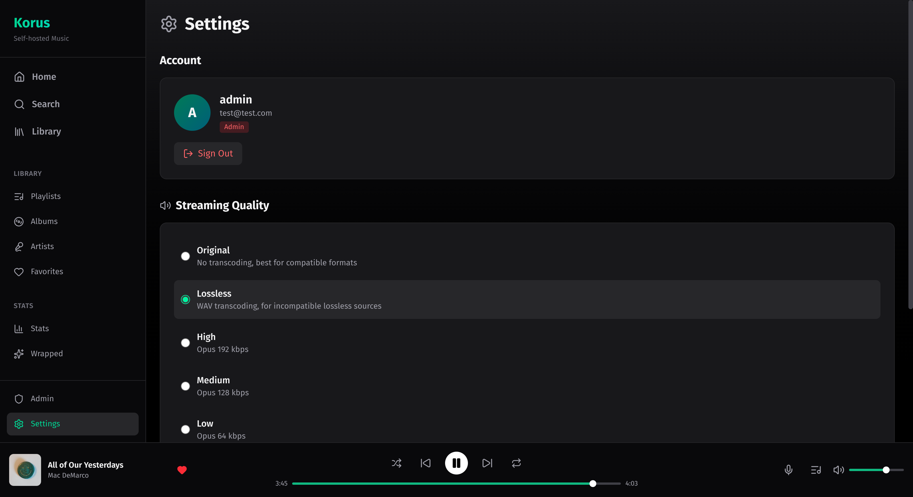

# Korus

Self-hosted music streaming server with a web interface.

## Features

- **Library management** - Automatic scanning with file watch support, artist/album/song organization
- **Streaming** - Direct playback for browser-supported formats, on-the-fly transcoding for others
- **Lossless support** - WAV transcoding with seeking for ALAC/FLAC files that browsers can't play natively
- **Playlists** - Create and manage custom playlists
- **Favorites** - Mark songs, albums, and artists as favorites
- **Search** - Full-text search across your library
- **Listening history** - Track what you've played
- **Stats** - Listening statistics with time period filters
- **Wrapped** - Year-in-review style listening summary
- **Radio** - LLM-powered song recommendations based on your library
- **Metadata enrichment** - Automatic artist images and multi-artist support via ISRC lookup
- **Lyrics** - Display lyrics when available
- **Queue management** - Reorder, add, remove tracks
- **Command palette** - Quick navigation and actions with keyboard shortcuts
- **MusicBrainz integration** - Enrich metadata from MusicBrainz
- **ListenBrainz scrobbling** - Submit listens to ListenBrainz
- **Multi-user** - User accounts with JWT authentication

## Screenshots

| Home | Library |
|------|---------|
|  |  |

| Album Details | Search |
|---------------|--------|
|  |  |

| Queue | Lyrics |
|-------|--------|
|  |  |

| Stats | Settings |
|-------|----------|
|  |  |

## Tech Stack

**Backend**
- Go with Echo framework
- SQLite database (modernc.org/sqlite, no CGO)
- FFmpeg/FFprobe for audio processing and transcoding

**Frontend**
- SvelteKit with Svelte 5
- Tailwind CSS 4
- TypeScript

## Requirements

- Go 1.24+
- Node.js / Bun (for frontend)
- FFmpeg and FFprobe in PATH (or set `FFMPEG_PATH` / `FFPROBE_PATH`)

**Note:** Korus can run fully offline with no external service dependencies. All integrations (metadata enrichment, radio, MusicBrainz, ListenBrainz) are optional and disabled by default except metadata enrichment. To run completely standalone, set `METADATA_ENRICH_ENABLED=false`. However, enabling radio (requires an OpenRouter API key) is recommended for the best music discovery experience.

## Setup

### Backend

```bash
# Set required environment variables
export JWT_SECRET="your-secret-key"
export MEDIA_ROOT="/path/to/your/music"

# Run the server
go run ./cmd/server

# Or build and run
go build -o korus ./cmd/server
./korus
```

### Frontend

```bash
cd web
bun install
bun run dev      # Development
bun run build    # Production build
```

## Configuration

Environment variables:

| Variable | Default | Description |
|----------|---------|-------------|
| `ADDR` | `:8080` | Server address |
| `DB_PATH` | `./korus.db` | SQLite database path |
| `MEDIA_ROOT` | `./media` | Music library path |
| `JWT_SECRET` | - | Required. Secret for JWT tokens |
| `TOKEN_TTL` | `15m` | Access token lifetime |
| `REFRESH_TTL` | `7d` | Refresh token lifetime |
| `FFMPEG_PATH` | `ffmpeg` | Path to ffmpeg binary |
| `FFPROBE_PATH` | `ffprobe` | Path to ffprobe binary |

### Scanner

| Variable | Default | Description |
|----------|---------|-------------|
| `SCAN_WATCH` | `false` | Watch for file changes |
| `SCAN_EXCLUDE_PATTERN` | - | Regex pattern to exclude files |
| `SCAN_EMBEDDED_COVER` | `true` | Extract embedded cover art |

### Integrations

| Variable | Default | Description |
|----------|---------|-------------|
| `METADATA_ENRICH_ENABLED` | `true` | Enable metadata enrichment (artist images, multi-artist) |
| `METADATA_ENRICH_URL` | `https://metadata.aun.rest` | Metadata enrichment API URL |
| `ENABLE_MUSICBRAINZ` | `false` | Enable MusicBrainz metadata enrichment |
| `MUSICBRAINZ_AGENT` | - | User agent for MusicBrainz API |
| `ENABLE_LISTENBRAINZ` | `false` | Enable ListenBrainz scrobbling |
| `LISTENBRAINZ_TOKEN` | - | ListenBrainz API token |
| `LISTENBRAINZ_USER` | - | ListenBrainz username |

Metadata enrichment uses ISRC codes embedded in your audio files to fetch artist images and properly split multi-artist tracks (e.g., "Artist A feat. Artist B"). This runs automatically during library scans.

The default metadata API is hosted at `https://metadata.aun.rest`. You can self-host your own instance using the [open source metadata API](https://github.com/Aunali321/spotify-metadata-api).

### Rate Limiting

| Variable | Default | Description |
|----------|---------|-------------|
| `RATE_LIMIT_AUTH_COUNT` | `5` | Auth attempts allowed |
| `RATE_LIMIT_AUTH_WINDOW` | `1m` | Time window for auth rate limit |

### Radio (LLM Recommendations)

| Variable | Default | Description |
|----------|---------|-------------|
| `RADIO_LLM_ENABLED` | `false` | Enable LLM-powered radio recommendations |
| `OPENROUTER_API_KEY` | - | OpenRouter API key (required if radio enabled) |
| `RADIO_LLM_MODEL` | `google/gemini-3-flash-preview` | LLM model to use |
| `RADIO_DEFAULT_LIMIT` | `20` | Default number of recommendations to return |

When enabled, the radio feature uses an LLM to find similar songs from your library based on genre, style, mood, and language. The entire library is rendered as a PDF and sent to the model for context.

**Radio Modes:**
- **Curator** (default): Better quality recommendations. Best for most queries, indie music, and discovery. Uses a compact PDF format.
- **Mainstream**: More predictable recommendations. Best for mainstream music only. Uses a detailed PDF format.

**Estimated costs (using OpenRouter with Gemini Flash):**
- Curator mode: ~1500 requests per $1
- Mainstream mode: ~400 requests per $1

If disabled or if the LLM fails, radio falls back to metadata-based recommendations (same artist/album/year).

## API

### Auth
- `POST /api/auth/register` - Create account
- `POST /api/auth/login` - Login
- `POST /api/auth/refresh` - Refresh token
- `POST /api/auth/logout` - Logout
- `GET /api/auth/me` - Current user

### Library
- `GET /api/library` - Library overview
- `GET /api/artists/:id` - Artist details
- `GET /api/albums/:id` - Album details
- `GET /api/songs/:id` - Song details
- `GET /api/search?q=` - Search

### Streaming
- `GET /api/stream/:id` - Stream audio (optional `?format=&bitrate=`)
- `GET /api/artwork/:id` - Album/song artwork
- `GET /api/artist-image/:id` - Artist image
- `GET /api/lyrics/:id` - Song lyrics

### Playlists
- `GET /api/playlists` - List playlists
- `POST /api/playlists` - Create playlist
- `GET /api/playlists/:id` - Playlist details
- `PUT /api/playlists/:id` - Update playlist
- `DELETE /api/playlists/:id` - Delete playlist

### User Data
- `GET /api/favorites` - List favorites
- `POST /api/favorites/:type/:id` - Add favorite
- `DELETE /api/favorites/:type/:id` - Remove favorite
- `GET /api/history` - Listening history
- `POST /api/history` - Record listen
- `GET /api/stats` - Listening statistics
- `GET /api/home` - Home page data

### Library Scanning
- `POST /api/scan` - Trigger library scan
- `GET /api/scan/status` - Scan status

### Admin
- `GET /api/admin/system` - System info
- `DELETE /api/admin/sessions/cleanup` - Clean expired sessions
- `POST /api/admin/musicbrainz/enrich` - Enrich metadata
- `GET /api/admin/settings` - Get app settings
- `PUT /api/admin/settings` - Update app settings

### Radio
- `GET /api/radio/:id` - Get similar song recommendations

## Tests

```bash
# Backend
go test ./...

# Frontend
cd web && bun run check
```

## Keyboard Shortcuts

Press `Ctrl+K` (or `Cmd+K` on Mac) to open the command palette.

### Navigation

| Shortcut | Action |
|----------|--------|
| `Ctrl+0` | Go to Home |
| `Ctrl+1` | Go to Search |
| `Ctrl+2` | Go to Library |
| `Ctrl+3` | Go to Playlists |
| `Ctrl+4` | Go to Albums |
| `Ctrl+5` | Go to Artists |
| `Ctrl+6` | Go to Favorites |
| `Ctrl+7` | Go to Stats |
| `Ctrl+8` | Go to Settings |
| `Ctrl+9` | Go to Admin |

### Playback

| Shortcut | Action |
|----------|--------|
| `Space` | Play / Pause |
| `Left` | Seek Backward 10s |
| `Right` | Seek Forward 10s |
| `Shift+Left` | Previous Track |
| `Shift+Right` | Next Track |
| `Shift+S` | Toggle Shuffle |
| `Shift+R` | Toggle Repeat |
| `Shift+F` | Favorite Current Song |
| `Shift++` | Volume Up |
| `Shift+-` | Volume Down |

### View

| Shortcut | Action |
|----------|--------|
| `Shift+Q` | Toggle Queue |
| `Shift+L` | Toggle Lyrics |
