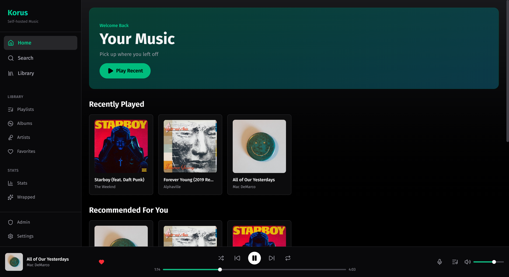
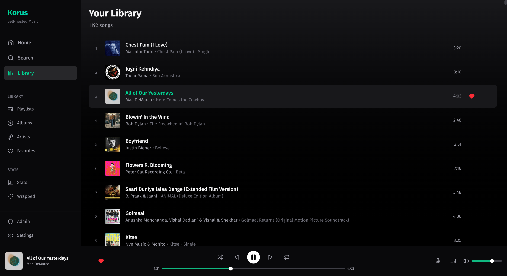
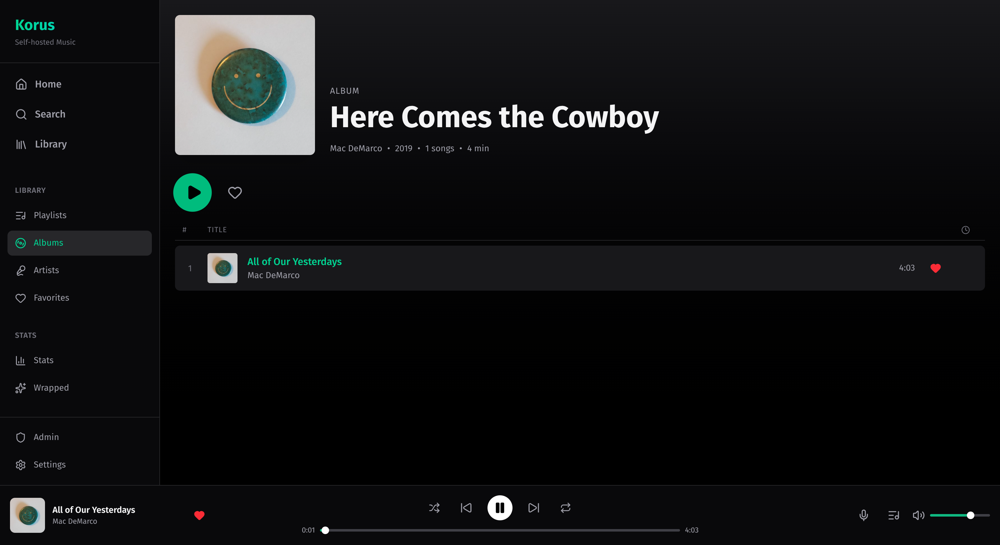
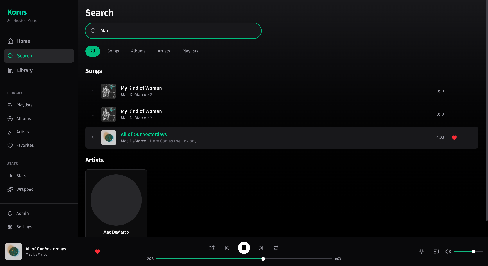
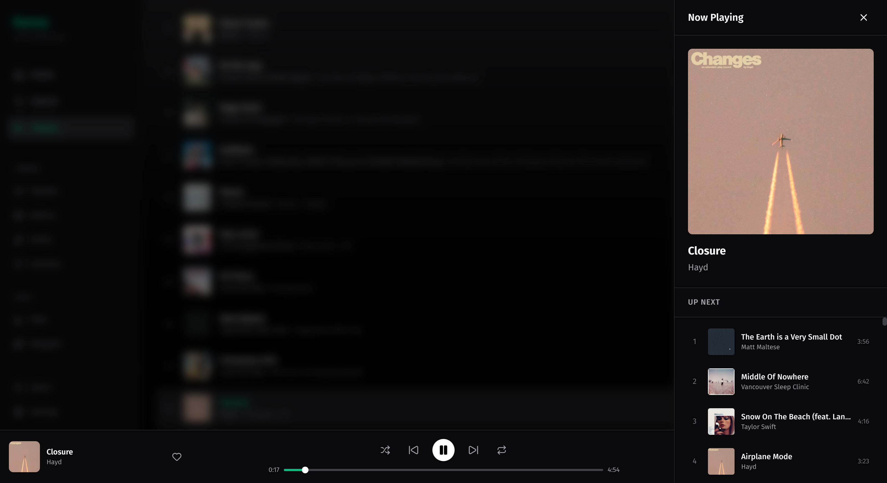
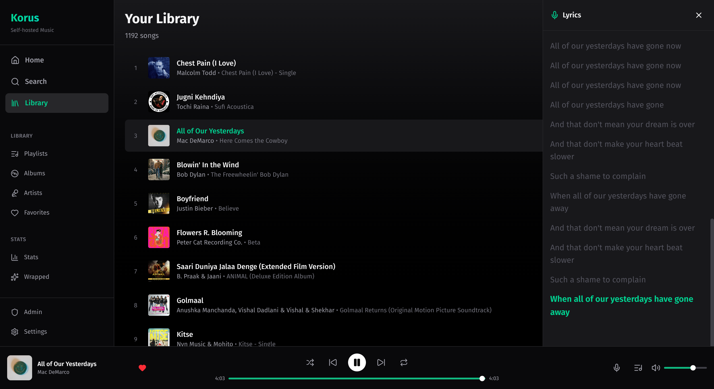
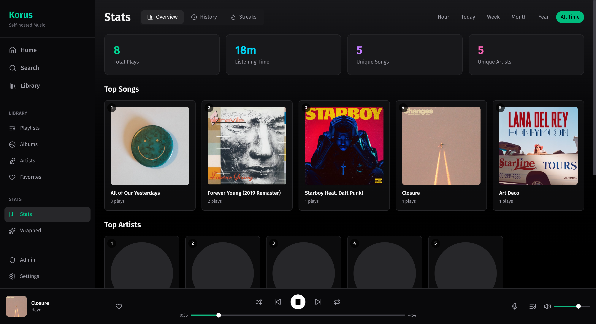
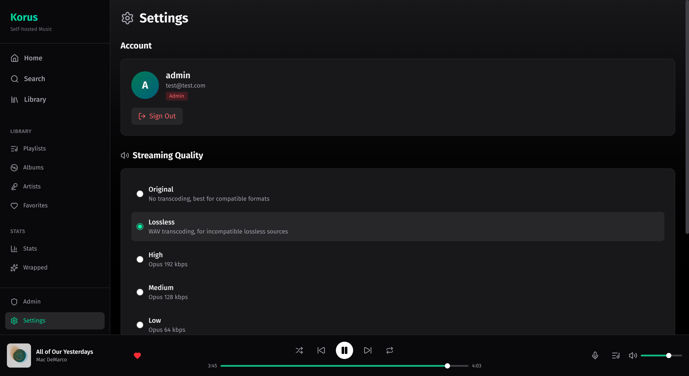

# Korus


Self-hosted music streaming server with a web interface.

## Features

- **Library management** - Automatic scanning with file watch support, artist/album/song organization
- **Streaming** - Direct playback for browser-supported formats, on-the-fly transcoding for others
- **Lossless support** - WAV transcoding with seeking for ALAC/FLAC files that browsers can't play natively
- **Playlists** - Create and manage custom playlists
- **Favorites** - Mark songs, albums, and artists as favorites
- **Search** - Full-text search across your library
- **Listening history** - Track what you've played
- **Stats** - Listening statistics with time period filters
- **Wrapped** - Year-in-review style listening summary
- **Radio** - LLM-powered song recommendations based on your library
- **Metadata enrichment** - Automatic artist images and multi-artist support via ISRC lookup
- **Lyrics** - Display lyrics when available
- **Queue management** - Reorder, add, remove tracks
- **Command palette** - Quick navigation and actions with keyboard shortcuts
- **MusicBrainz integration** - Enrich metadata from MusicBrainz
- **ListenBrainz scrobbling** - Submit listens to ListenBrainz
- **Multi-user** - User accounts with JWT authentication
- **Discord bot** - Browse, queue and listen together in voice, with per-user account links

## Screenshots

| Home | Library |
|------|---------|
|  |  |

| Album Details | Search |
|---------------|--------|
|  |  |

| Queue | Lyrics |
|-------|--------|
|  |  |

| Stats | Settings |
|-------|----------|
|  |  |

## Tech Stack

**Backend**
- Go with Echo framework
- SQLite database (modernc.org/sqlite, no CGO)
- FFmpeg/FFprobe for audio processing and transcoding

**Frontend**
- SvelteKit with Svelte 5
- Tailwind CSS 4
- TypeScript

## Requirements

- Go 1.24+
- Node.js / Bun (for frontend)
- FFmpeg and FFprobe in PATH (or set `FFMPEG_PATH` / `FFPROBE_PATH`)

**Note:** Korus can run fully offline with no external service dependencies. All integrations (metadata enrichment, radio, MusicBrainz, ListenBrainz) are optional and disabled by default except metadata enrichment. To run completely standalone, set `METADATA_ENRICH_ENABLED=false`. However, enabling AI features (requires an OpenRouter API key) is recommended for the best experience — they power the Ask assistant, smarter radio, and a dynamic Wrapped.

## Setup

### Backend

```bash
# Set required environment variables
export JWT_SECRET="your-secret-key"
export MEDIA_ROOT="/path/to/your/music"

# Run the server
go run ./cmd/server

# Or build and run
go build -o korus ./cmd/server
./korus
```

### Frontend

```bash
cd web
bun install
bun run dev      # Development
bun run build    # Production build
```

## Configuration

Environment variables:

| Variable | Default | Description |
|----------|---------|-------------|
| `ADDR` | `:8080` | Server address |
| `DB_PATH` | `./korus.db` | SQLite database path |
| `MEDIA_ROOT` | `./media` | Music library path |
| `JWT_SECRET` | - | Required. Secret for JWT tokens |
| `TOKEN_TTL` | `15m` | Access token lifetime |
| `REFRESH_TTL` | `7d` | Refresh token lifetime |
| `FFMPEG_PATH` | `ffmpeg` | Path to ffmpeg binary |
| `FFPROBE_PATH` | `ffprobe` | Path to ffprobe binary |

### Scanner

| Variable | Default | Description |
|----------|---------|-------------|
| `SCAN_WATCH` | `false` | Watch for file changes |
| `SCAN_EXCLUDE_PATTERN` | - | Regex pattern to exclude files |
| `SCAN_EMBEDDED_COVER` | `true` | Extract embedded cover art |

### Integrations

| Variable | Default | Description |
|----------|---------|-------------|
| `METADATA_ENRICH_ENABLED` | `true` | Enable metadata enrichment (artist images, multi-artist) |
| `METADATA_ENRICH_URL` | `https://metadata.aun.rest` | Metadata enrichment API URL |
| `ENABLE_MUSICBRAINZ` | `false` | Enable MusicBrainz metadata enrichment |
| `MUSICBRAINZ_AGENT` | - | User agent for MusicBrainz API |
| `ENABLE_LISTENBRAINZ` | `false` | Enable ListenBrainz scrobbling |
| `LISTENBRAINZ_TOKEN` | - | ListenBrainz API token |
| `LISTENBRAINZ_USER` | - | ListenBrainz username |

Metadata enrichment uses ISRC codes embedded in your audio files to fetch artist images and properly split multi-artist tracks (e.g., "Artist A feat. Artist B"). This runs automatically during library scans.

The default metadata API is hosted at `https://metadata.aun.rest`. You can self-host your own instance using the [open source metadata API](https://github.com/Aunali321/spotify-metadata-api).

### Rate Limiting

| Variable | Default | Description |
|----------|---------|-------------|
| `RATE_LIMIT_AUTH_COUNT` | `5` | Auth attempts allowed |
| `RATE_LIMIT_AUTH_WINDOW` | `1m` | Time window for auth rate limit |

### AI (Ask, Radio, Wrapped)

Korus's AI features run on a single LLM agent that reads your library and listening history through tools — nothing is sent to the model except what the tools return, via the provider you configure.

| Variable | Default | Description |
|----------|---------|-------------|
| `AI_ENABLED` | `false` | Enable AI features (Ask, smart radio, dynamic Wrapped) |
| `OPENROUTER_API_KEY` | - | OpenRouter API key (required when AI is enabled) |
| `AI_MODEL` | `arcee-ai/trinity-large-thinking:arcee-ai` | OpenRouter model id |
| `AI_REASONING` | `medium` | Reasoning effort: `off`, `minimal`, `low`, `medium`, `high`, `xhigh` |
| `RADIO_DEFAULT_LIMIT` | `20` | Default number of radio songs to return |

**What it powers:**
- **Ask** — a streaming chat assistant that searches your library, builds/edits playlists, controls playback, and answers questions. Replies can include inline cards, charts, and song lists.
- **Radio** — `GET /api/radio/{id}` builds a personalized queue from a seed song using your taste, falling back to metadata scoring (same artist/album/year) when AI is disabled or fails.
- **Wrapped** — a month/year listening recap rendered from an AI-generated UI, generated once per period and cached.

**Endpoints:** `POST /api/ai/chat` (SSE: `text`/`tool`/`ui`/`action`/`done`), `GET|DELETE /api/ai/conversations[/{id}]`, `GET /api/ai/wrapped?period=month|year`, `GET /api/radio/{id}`.

## API

### Auth
- `POST /api/auth/register` - Create account
- `POST /api/auth/login` - Login
- `POST /api/auth/refresh` - Refresh token
- `POST /api/auth/logout` - Logout
- `GET /api/auth/me` - Current user

### Library
- `GET /api/library` - Library overview
- `GET /api/artists/:id` - Artist details
- `GET /api/albums/:id` - Album details
- `GET /api/songs/:id` - Song details
- `GET /api/search?q=` - Search

### Streaming
- `GET /api/stream/:id` - Stream audio (optional `?format=&bitrate=`)
- `GET /api/artwork/:id` - Album/song artwork
- `GET /api/artist-image/:id` - Artist image
- `GET /api/lyrics/:id` - Song lyrics

### Playlists
- `GET /api/playlists` - List playlists
- `POST /api/playlists` - Create playlist
- `GET /api/playlists/:id` - Playlist details
- `PUT /api/playlists/:id` - Update playlist
- `DELETE /api/playlists/:id` - Delete playlist

### User Data
- `GET /api/favorites` - List favorites
- `POST /api/favorites/:type/:id` - Add favorite
- `DELETE /api/favorites/:type/:id` - Remove favorite
- `GET /api/history` - Listening history
- `POST /api/history` - Record listen
- `GET /api/stats` - Listening statistics
- `GET /api/home` - Home page data

### Library Scanning
- `POST /api/scan` - Trigger library scan
- `GET /api/scan/status` - Scan status

### Admin
- `GET /api/admin/system` - System info
- `DELETE /api/admin/sessions/cleanup` - Clean expired sessions
- `POST /api/admin/musicbrainz/enrich` - Enrich metadata
- `GET /api/admin/settings` - Get app settings
- `PUT /api/admin/settings` - Update app settings

### Radio
- `GET /api/radio/:id` - Get similar song recommendations

## Discord bot

A second binary, `cmd/bot`, puts the library in a Discord server: browsing, stats, playlists and voice playback.

Discord requires DAVE end-to-end encryption on voice connections, so the bot
links [libdave](https://github.com/discord/libdave) through cgo. Install it once
before building:

```bash
git clone https://github.com/disgoorg/godave && cd godave
./scripts/libdave_install.sh v1.1.0
export PKG_CONFIG_PATH="$HOME/.local/lib/pkgconfig:$PKG_CONFIG_PATH"
```

```bash
export DISCORD_TOKEN="your-bot-token"
go run ./cmd/bot
```

| Variable | Default | Description |
|----------|---------|-------------|
| `DISCORD_TOKEN` | - | Required. Bot token |
| `DISCORD_GUILD_ID` | - | Register commands to one server instead of globally, for instant updates while developing |
| `BOT_DB_PATH` | `./bot.db` | SQLite database of account links |
| `FFMPEG_PATH` | `ffmpeg` | Path to ffmpeg binary |

The bot needs the `applications.commands` and `bot` scopes, and the View Channels, Send Messages, Attach Files, Connect and Speak permissions. FFmpeg must be on `PATH`.

`/captions` follows the playing track line by line, rewriting one message as the
lyrics advance. It reads the `lyrics_synced` LRC column, so it only works for
tracks that have timed lyrics, and it picks up again on the next track that does.

It ships as its own image, `ghcr.io/aunali321/korus-bot`, built from `Dockerfile.bot`. Discord publishes libdave as a glibc-only prebuilt needing GLIBC 2.38, so the bot cannot share the server's Alpine base.

### Accounts

Each Discord user links their own Korus account with `/login`, so the bot is multi-tenant: `/stats`, `/wrapped`, `/playlists` and `/lyrics` always read the caller's account, and nobody can write to anyone else's.

Playback is shared, so it works differently. The first person to `/play` in a server becomes the session host, and the whole queue streams from their library. Anyone in the same voice channel can browse and queue from it, which is what makes group listening work.

Listening history follows the person who queued the track, not the host, and only when that person has an account on the same server. So queueing in someone else's session never lands in their stats, and a guest with no account on that server simply records nothing.

Tokens refresh automatically and are written back to `bot.db`. A dead refresh token drops the link and asks the user to `/login` again.

### Commands

| Command | Description |
|---------|-------------|
| `/login url username password` | Link a Korus account |
| `/logout` | Unlink, ending your playback session |
| `/whoami` | Show the linked account |
| `/search query` | Songs, albums, artists and playlists, with a menu to play a result |
| `/album title` | Album detail and tracklist, with a button to queue it |
| `/artist name` | Biography, albums and top tracks |
| `/lyrics song` | Lyrics, falling back to the synced copy |
| `/stats period` | Plays, listening time and top songs, artists and albums |
| `/wrapped period` | Recap of a week, month, year or all time |
| `/playlists` | List your playlists |
| `/playlist view\|create\|add\|remove` | Manage a playlist |
| `/play query` | Join your voice channel and play or queue a song |
| `/radio seed limit` | Queue a station, seeded by a song or your last play |
| `/pause` `/resume` `/skip` `/stop` | Playback control |
| `/queue` `/nowplaying` | Live player views with buttons |

Titles, albums, artists, playlists and playlist-scoped songs all autocomplete against the library the session is reading from.

### Playback

Audio comes from the authenticated `/api/download/{id}` endpoint, transcoded by FFmpeg to 128k Opus at 48kHz stereo and fed to Discord as 20ms frames. The access token travels in an HTTP header, never in a URL. The bot leaves when the queue drains, when it is disconnected, or when the last listener leaves the channel.

Every message is built from Discord's Components V2 containers rather than embeds. Cover art is uploaded as an attachment instead of linked, so it still renders when Korus is only reachable on a private network.

## Tests

```bash
# Backend
go test ./...

# Frontend
cd web && bun run check
```

## Keyboard Shortcuts

Press `Ctrl+K` (or `Cmd+K` on Mac) to open the command palette.

### Navigation

| Shortcut | Action |
|----------|--------|
| `Ctrl+0` | Go to Home |
| `Ctrl+1` | Go to Search |
| `Ctrl+2` | Go to Library |
| `Ctrl+3` | Go to Playlists |
| `Ctrl+4` | Go to Albums |
| `Ctrl+5` | Go to Artists |
| `Ctrl+6` | Go to Favorites |
| `Ctrl+7` | Go to Stats |
| `Ctrl+8` | Go to Settings |
| `Ctrl+9` | Go to Admin |

### Playback

| Shortcut | Action |
|----------|--------|
| `Space` | Play / Pause |
| `Left` | Seek Backward 10s |
| `Right` | Seek Forward 10s |
| `Shift+Left` | Previous Track |
| `Shift+Right` | Next Track |
| `Shift+S` | Toggle Shuffle |
| `Shift+R` | Toggle Repeat |
| `Shift+F` | Favorite Current Song |
| `Shift++` | Volume Up |
| `Shift+-` | Volume Down |

### View

| Shortcut | Action |
|----------|--------|
| `Shift+Q` | Toggle Queue |
| `Shift+L` | Toggle Lyrics |
